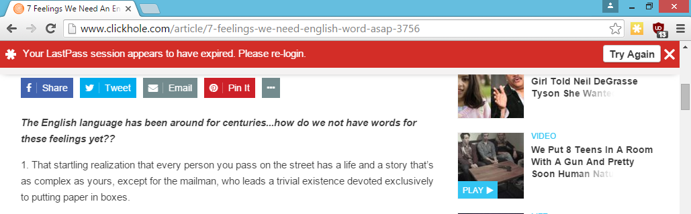
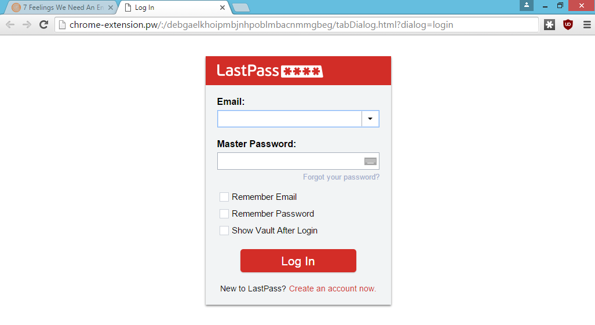
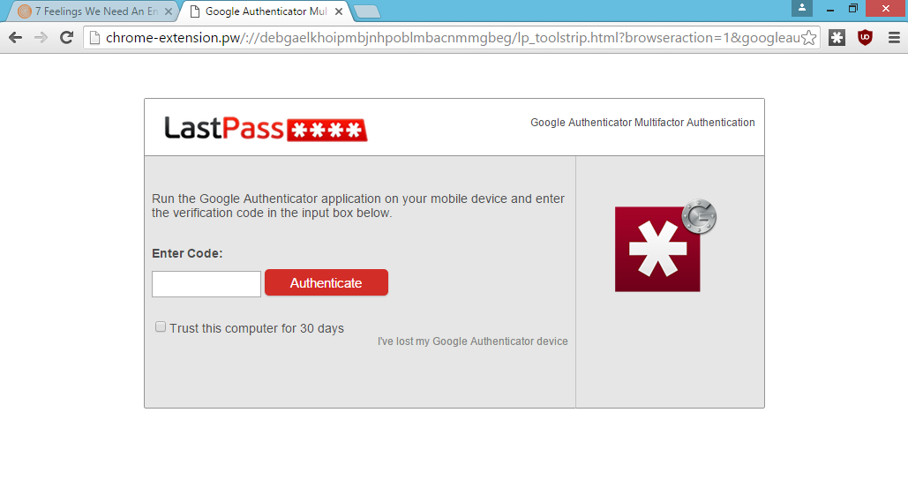
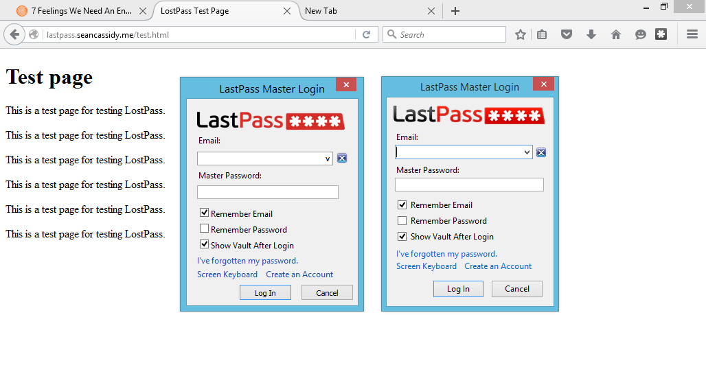

# LostPass

A tool to phish LastPass accounts. See [my blog
post](https://www.seancassidy.me/lostpass.html) for more information.

## Screenshots

This is LostPass in action.

### Chrome notification

This notification pops up on a benign-looking website.

### Chrome login screen

This is shown after the user clicks our malicious notification.

Notice how it uses the domain `chrome-extension.pw`, which is close to Chrome's
built-in `chrome-extension` protocol. Since the connection is over HTTP, the
icon looks similar. This 
[Chromium issue](https://code.google.com/p/chromium/issues/detail?id=453093) 
is open to address this issue.

### Chrome two-factor prompt

This is shown if the user has two-factor authentication enabled.

### Firefox login on Windows 8

This is drawn using HTML5 and CSS. Even the Windows appear/close animation is
done. One of them is real, one of them is LostPass. Which one?

## How it works

1. Get the victim to go to a malicious website that looks benign, or a real
   website that is vulnerable to XSS
2. If they have LastPass installed, show the login expired notification and log
   the user out of LastPass (Logout CSRF)
3. Once the victim clicks on the fake banner, direct them to an
   attacker-controlled login page that looks identical to the LastPass one
4. The victim will enter their password and send the credentials to the
   attacker's server
5. If the username and password is incorrect, redirect them back to the
   malicious site and redisplay the banner with "Invalid Password"
6. If the user has two-factor authentication, redirect them to a two-factor
   authentication page. Once they enter their two-factor token, try it.
7. Once the attacker has the correct username and password (and two-factor
   token), download all of the victim's information from the LastPass API

LostPass does steps 2 through 7. Some things to note about why this is so 
effective:

- Many responses to the phishing problem are "Train the users", as if it was
  their fault that they were phished. Training is not effective at combating
  LostPass because there is little to no difference in what is shown to the 
  user
- LastPass's login workflow is complex and somewhat buggy. Sometimes it shows
  in-viewport login pages, and sometimes it shows them as popup windows.
- It is easy to detect LastPass and it was even easier to find the exact HTML
  and CSS that LastPass uses to show notifications and login pages
- It even phishes for the two-factor auth code, so 2FA is no help

See [the FAQ I wrote](https://www.seancassidy.me/lostpass.html) for more
information.

## Setup

After getting nodejs and npm installed:

    npm install -g grunt-cli
    npm install
    grunt

To run server.py, you'll need lastpass-python and bottle.

    virtualenv env
    source env/bin/activate
    pip install lastpass-python bottle
    cd chrome4/
    python server.py

It seems that there are some bugs in lastpass-python as not all accounts can be
logged in to.

## Status

This is a proof-of-concept. It is not written particularly well or
maintainable. I am not particularly interested in making it weaponized. I may
accept PRs if they are useful or instructive or fix obvious bugs.

